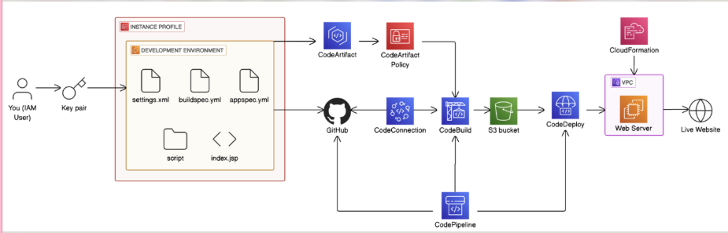

# AWS CI/CD Pipeline — Java Web App Deployment

  

A fully automated CI/CD pipeline built on AWS that detects code changes on GitHub, automatically builds a Java web application, and deploys it to an EC2 server — with zero manual steps.

> **"If you see this line, that means your latest changes are automatically deployed into production by CodePipeline!"**

---

## Live Demo

---

## Architecture

An IAM user creates the development environment — including `settings.xml`, `buildspec.yml`, `appspec.yml`, deployment scripts, and `index.jsp` — secured with a key pair and instance profile. Code is pushed from the development environment to GitHub, which triggers CodePipeline via CodeConnection. CodeBuild fetches dependencies from CodeArtifact, compiles the app, and stores the artifact in an S3 bucket. CodeDeploy then picks up the artifact and deploys it to the Web Server inside a VPC, provisioned by CloudFormation — making the app live on the internet.

---

## Pipeline Success

Every push to the `master` branch triggers the full Source → Build → Deploy pipeline automatically.

---

## What This Project Demonstrates

This project is built across 6 parts of the [NextWork DevOps Series](https://nextwork.org):

- **Part 1 — [Set Up a Web App in the Cloud](https://learn.nextwork.org/projects/aws-devops-vscode):** Launch an EC2 instance, connect with VS Code via Remote SSH, install Java and Maven, and create a Java web application
- **Part 2 — [Connect a GitHub Repo with AWS](https://learn.nextwork.org/projects/aws-devops-github):** Install Git, push the project to GitHub, and set up version control for the pipeline
- **Part 3 — [Store Dependencies in CodeArtifact](https://learn.nextwork.org/projects/aws-devops-codeartifact-updated):** Set up a private Maven repository in CodeArtifact to securely manage Java dependencies instead of pulling from the public internet
- **Part 4 — [Package an App with CodeBuild](https://learn.nextwork.org/projects/aws-devops-codebuild-updated):** Write a `buildspec.yml` to automate compiling and packaging the app into a `.war` file
- **Part 5 — [Deploy an App with CodeDeploy](https://learn.nextwork.org/projects/aws-devops-codedeploy-updated):** Write `appspec.yml` and deployment scripts to automate installing the app on the EC2 server using Tomcat
- **Part 6 — [CI/CD with CodePipeline](https://learn.nextwork.org/projects/aws-devops-codepipeline-updated):** Connect all stages into one automated pipeline triggered by every GitHub push

---

## AWS Services Used

| Service | Purpose |
|---|---|
| **Amazon EC2** | Virtual server hosting the Java web app via Apache Tomcat |
| **AWS CloudFormation** | Provisions EC2, VPC, security groups, and IAM roles as Infrastructure as Code |
| **AWS CodeArtifact** | Private Maven repository for secure dependency management |
| **AWS CodeBuild** | Builds and packages the Java app into a `.war` file |
| **AWS CodeDeploy** | Deploys the built artifact to EC2 automatically |
| **AWS CodePipeline** | Orchestrates the full Source → Build → Deploy workflow |
| **Amazon S3** | Stores build artifacts between pipeline stages |
| **AWS IAM** | Manages permissions between all services |
| **GitHub** | Source control — pipeline triggers on every push to `master` |
| **VS Code** | IDE used to develop directly on the EC2 instance via Remote SSH |

---

## How It Was Built — Step by Step

**1. Launched an EC2 instance with a key pair**
Created an Amazon Linux EC2 instance (t3.micro), configured security groups for SSH and HTTP access, and generated a `.pem` key pair for secure authentication.

**2. Connected VS Code to EC2 via Remote SSH**
Installed the Remote-SSH extension in VS Code, configured the SSH `config` file with the EC2 hostname and key pair path, and connected directly to the server from the IDE.

**3. Installed Java and Maven**
Installed Amazon Corretto 8 (Java) and Apache Maven on the EC2 instance. Maven is the build tool that downloads dependencies and compiles the Java app.

**4. Created the Java web application**
Used the Maven archetype command to generate a Java web app project structure, then edited `index.jsp` to create the web page content.

**5. Installed Git and connected to GitHub**
Installed Git on EC2, configured identity, initialised a local repository, and pushed the project to a GitHub repository using a Personal Access Token.

**6. Set up AWS CodeArtifact**
Created a CodeArtifact domain and repository with Maven Central as the upstream source. Configured `settings.xml` to route all Maven dependency requests through the private repository using a temporary auth token.

**7. Wrote buildspec.yml for CodeBuild**
Created a `buildspec.yml` instruction file telling CodeBuild to authenticate with CodeArtifact, compile the Java code, and package it into a `.war` file. Configured the artifacts section to include `appspec.yml` and `scripts/` for CodeDeploy.

**8. Set up the deployment server with CloudFormation**
Used a CloudFormation template to provision the deployment EC2 instance, VPC, subnet, security groups, and IAM roles. The template includes a UserData script to auto-install the CodeDeploy agent and Tomcat on launch.

**9. Wrote appspec.yml and deployment scripts**
Created `appspec.yml` as the instruction manual for CodeDeploy, along with three shell scripts — `install_dependencies.sh`, `start_server.sh`, and `stop_server.sh` — to manage the Tomcat server during each deployment lifecycle stage.

**10. Created CodeDeploy application and deployment group**
Set up a CodeDeploy application targeting the EC2 instance using the `role: webserver` tag. Configured the deployment group with `CodeDeployDefault.AllAtOnce` strategy.

**11. Built the CodePipeline**
Connected all stages: GitHub (via GitHub App) as the source, CodeBuild for the build stage, and CodeDeploy for the deploy stage. The pipeline triggers automatically on every push to the `master` branch via webhook.

**12. Tested end-to-end automation**
Updated `index.jsp`, pushed to GitHub, and watched the pipeline automatically trigger, build, and deploy — with the updated text appearing live on the server within minutes.

---

## Troubleshooting & Lessons Learned

Real issues encountered and resolved during the project:

**Wrong AWS region in settings.xml**
The CodeArtifact URL pointed to `eu-north-1` (Stockholm) while all resources were in `us-east-1`. This caused `Unauthorized` errors during the Maven build. Fixed by updating the URL to the correct region — a reminder to always check the region selector in the AWS Console before creating resources.

**CodeBuild missing CodeArtifact permissions**
Each time the CodeBuild project was recreated, its new service role had no CodeArtifact permissions, causing the pre_build phase to fail with exit status 254. Fixed by attaching `AWSCodeArtifactReadOnlyAccess` to the CodeBuild service role.

**Windows SSH key permission errors**
Windows OpenSSH enforces strict ACL permissions that conflicted with WSL file paths, causing `Permission denied (publickey)` errors. Fixed by storing the `.pem` key in WSL `~/.ssh/` for terminal use and copying it to `C:\Users\rukky\.ssh\` for VS Code Remote-SSH. Linux `chmod 400` handled permissions correctly.

**CodePipeline "No Branch master found"**
The repository field required `username/repo-name` format, not the full GitHub URL. Fixed by changing the input from the full HTTPS URL to `rukkylatunde2001/nextwork-cicd-webproject`.

**EC2 IP changing after restart**
AWS assigns a new public IP every time an instance restarts, breaking SSH config and security group rules. Workaround: update the security group SSH rule to "My IP" after each restart and update the SSH config with the new IP. Long-term fix: use an Elastic IP for a permanent address.

---

## About the Author

**Rukayat Alarape**
AWS DevOps learner | NextWork Student

Built as part of the [NextWork 6-Part DevOps Series](https://nextwork.org).

- GitHub: [@rukkylatunde2001](https://github.com/rukkylatunde2001)
- Email: rukkylatunde2001@gmail.com

---

*Part of the NextWork DevOps Series: Set Up a Web App → Connect GitHub → Store Dependencies → Package App → Deploy App → **CI/CD with CodePipeline** ✅*
