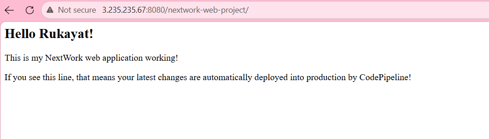
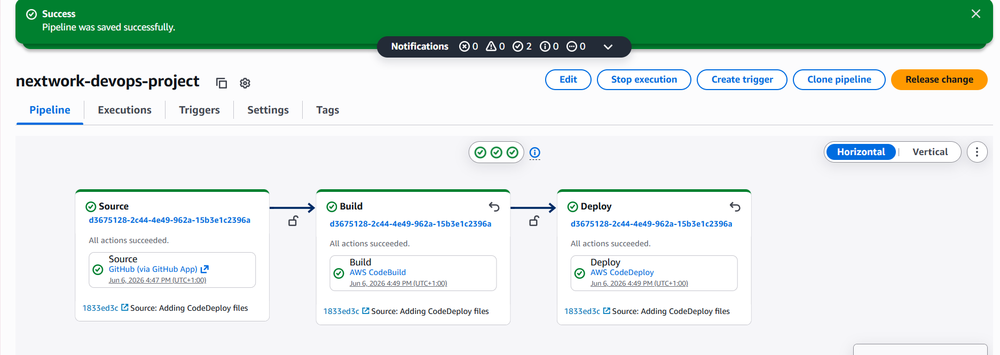

# AWS CI/CD Pipeline — Java Web App Deployment

  

A fully automated CI/CD pipeline built on AWS that detects code changes on GitHub, automatically builds a Java web application, and deploys it to an EC2 server — with zero manual steps.

> **"If you see this line, that means your latest changes are automatically deployed into production by CodePipeline!"**

---

## Live Demo



The app is deployed to an EC2 instance and served via Apache Tomcat on port 8080. Every push to the `master` branch triggers the full pipeline automatically.

---

## Pipeline Overview



```
Push code to GitHub
        ↓
CodePipeline detects change (webhook)
        ↓
CodeBuild fetches packages from CodeArtifact
    → Compiles Java source code
    → Packages into .war file
    → Saves artifact to S3
        ↓
CodeDeploy picks up artifact from S3
    → Stops Tomcat on EC2
    → Copies new .war to Tomcat webapps/
    → Starts Tomcat
    → Validates app is running
        ↓
Updated app is LIVE ✅
```

---

## Table of Contents

- [Project Overview](#project-overview)
- [AWS Services Used](#aws-services-used)
- [Architecture](#architecture)
- [Project Structure](#project-structure)
- [Key Configuration Files](#key-configuration-files)
- [Troubleshooting & Lessons Learned](#troubleshooting--lessons-learned)
- [About the Author](#about-the-author)

---

## Project Overview

This project is **Part 6 of the NextWork DevOps Series** — a hands-on challenge to build a production-style CI/CD pipeline from scratch on AWS.

**What this project demonstrates:**
- Launching and configuring EC2 infrastructure using CloudFormation (Infrastructure as Code)
- Connecting a GitHub repository to AWS as the source of truth for deployments
- Setting up a private Maven package repository with AWS CodeArtifact for secure dependency management
- Automating the build process with AWS CodeBuild using a custom `buildspec.yml`
- Automating deployments with AWS CodeDeploy using lifecycle hooks and deployment scripts
- Tying everything together with AWS CodePipeline for a fully automated end-to-end workflow

**The result:** Change one line of code, push to GitHub, and the update is live on the server in under 5 minutes — automatically.

---

## AWS Services Used

| Service | Purpose |
|---|---|
| **Amazon EC2** | Virtual server hosting the Java web application via Apache Tomcat |
| **AWS CloudFormation** | Infrastructure as Code — provisions EC2, VPC, security groups, and IAM roles in one template |
| **AWS CodeArtifact** | Private Maven repository for securely managing Java dependencies |
| **AWS CodeBuild** | Builds and packages the Java app into a `.war` file |
| **AWS CodeDeploy** | Deploys the built artifact to the EC2 instance automatically |
| **AWS CodePipeline** | Orchestrates the full Source → Build → Deploy workflow |
| **Amazon S3** | Stores build artifacts between pipeline stages |
| **AWS IAM** | Manages permissions between all services |
| **GitHub** | Source control — pipeline triggers on every push to `master` |

---

## Architecture

```
┌─────────────┐     webhook      ┌──────────────────────────────────────────┐
│   GitHub    │ ──────────────► │              AWS CodePipeline             │
│  (master)   │                  │                                          │
└─────────────┘                  │  ┌──────────┐  ┌──────────┐  ┌────────┐ │
                                  │  │  Source  │─►│  Build   │─►│ Deploy │ │
                                  │  └──────────┘  └──────────┘  └────────┘ │
                                  └──────────────────────────────────────────┘
                                           │              │            │
                                      GitHub App    CodeBuild    CodeDeploy
                                                         │            │
                                                  CodeArtifact    EC2 + Tomcat
                                                  (dependencies)
                                                         │
                                                    S3 Bucket
                                                   (artifacts)
```

**Deployment server** is provisioned using CloudFormation with:
- A custom VPC and public subnet
- Security group allowing HTTP (port 80) and application traffic (port 8080)
- IAM instance profile granting EC2 access to S3 and CodeDeploy
- CodeDeploy agent and Apache Tomcat pre-installed via UserData script

---

## Project Structure

```
nextwork-cicd-webproject/
├── src/
│   └── main/
│       └── webapp/
│           ├── WEB-INF/
│           │   └── web.xml
│           └── index.jsp          # Main web page
├── scripts/
│   ├── install_dependencies.sh    # Installs Tomcat and dependencies
│   ├── start_server.sh            # Starts Tomcat after deployment
│   └── stop_server.sh             # Safely stops Tomcat before deployment
├── appspec.yml                    # CodeDeploy instruction manual
├── buildspec.yml                  # CodeBuild instruction manual
├── pom.xml                        # Maven project configuration
└── settings.xml                   # Maven → CodeArtifact connection settings
```

---

## Key Configuration Files

### buildspec.yml
Tells CodeBuild how to build the application. Key phases:
- **pre_build** — authenticates with CodeArtifact to fetch private packages
- **build** — compiles Java source code with Maven
- **post_build** — packages the app into a `.war` file
- **artifacts** — specifies which files to pass to CodeDeploy (`.war`, `appspec.yml`, `scripts/`)

### appspec.yml
Tells CodeDeploy how to deploy the application. Key sections:
- **files** — copies the `.war` file to Tomcat's `webapps/` directory
- **BeforeInstall hook** — runs `install_dependencies.sh` to set up Tomcat
- **ApplicationStart hook** — runs `start_server.sh` to start the server
- **ApplicationStop hook** — runs `stop_server.sh` to safely stop before update

### settings.xml
Configures Maven to authenticate with AWS CodeArtifact using a temporary token, routing all dependency requests to the private repository instead of the public internet.

---

## Troubleshooting & Lessons Learned

Building this pipeline involved real-world debugging. Here are the key issues encountered and how they were resolved:

**CodeDeploy agent not found on EC2**
The CloudFormation template did not include a UserData script to auto-install the CodeDeploy agent. The fix was adding a UserData block to the template so every new EC2 instance comes pre-configured — no manual setup needed.

**`aartifacts` typo in buildspec.yml**
A double-`a` typo (`aartifacts` instead of `artifacts`) meant CodeBuild never saved any output files to S3. CodeDeploy had nothing to deploy. The fix was a one-character correction — a good reminder to always validate configuration file keys carefully.

**Wrong AWS region in settings.xml**
The CodeArtifact URL pointed to `eu-north-1` (Stockholm) while all other resources were in `us-east-1`. This caused `Unauthorized` errors during the Maven build. Fix: updated the URL to the correct region.

**CodeBuild missing CodeArtifact permissions**
Each time the CodeBuild project was recreated, its new service role started with no CodeArtifact permissions. Fix: manually attached `AWSCodeArtifactReadOnlyAccess` to the CodeBuild service role.

**Windows SSH key permission errors**
Windows OpenSSH enforces strict ACL permissions that conflict with WSL file paths. Fix: kept the `.pem` key in the WSL `~/.ssh/` directory for terminal use, and copied it to `C:\Users\rukky\.ssh\` for VS Code Remote-SSH. Linux `chmod 400` handled permissions correctly without the Windows ACL fight.

**EC2 IP changing after restart**
AWS assigns a new public IP every time an EC2 instance restarts. Fix: use an Elastic IP for a permanent address, or update the security group's SSH rule to "My IP" and update the SSH config after each restart.

**CodePipeline "No Branch master found"**
The repository name field required `username/repo-name` format, not the full GitHub URL. Fix: changed `https://github.com/rukkylatunde2001/nextwork-cicd-webproject.git` to `rukkylatunde2001/nextwork-cicd-webproject`.

---

## About the Author

**Rukayat Alarape**
AWS DevOps learner | NextWork Student

Built as part of the [NextWork 6-Part DevOps Series](https://nextwork.org) — a hands-on curriculum for building real cloud infrastructure from scratch.

- GitHub: [@rukkylatunde2001](https://github.com/rukkylatunde2001)
- Email: rukkylatunde2001@gmail.com

---

*Part of the NextWork DevOps Series: Set Up a Web App → Connect GitHub → Secure Packages with CodeArtifact → Continuous Integration with CodeBuild → Deploy with CodeDeploy → **CI/CD with CodePipeline** ✅*
